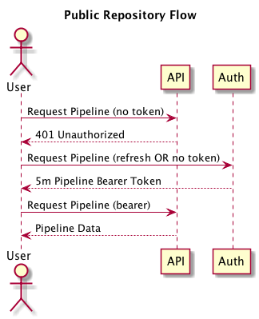
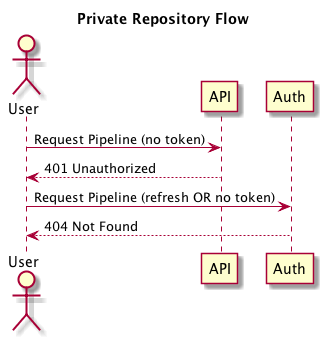
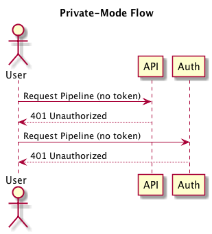
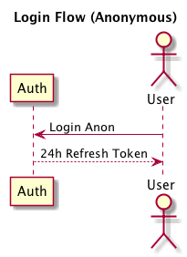
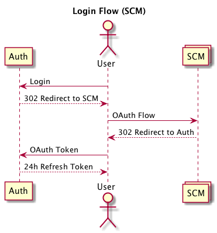

# Auth Service

## Context

This is a rewrite of how we do authentication and authorization in the Screwdriver world.  The purpose of this is to harden our security as well as enable us to support private repositories.  Much of what is being proposed here is based on the [JWT Spec](https://tools.ietf.org/html/draft-ietf-oauth-json-web-token-32) and Docker Hub's [implementation](https://docs.docker.com/registry/spec/auth/jwt/).

## New Service (Auth)

We should add a new service, called `auth`, that owns authentication and authorization.  This will be the entry point for users to authenticate via OAuth or Access Tokens as well authorize Bearer Tokens for API access.

### Token Types

 - *Refresh* - 12h signed JWT for authenticating a user for the Auth service.
 - *Bearer* - 5m signed JWT for authorizing specific operations against the Screwdriver API.

### Login Types

Tokens will be given out for logged-in users, anonymous users, and builds.  Subject will be based on the type:

 - Logged-in User - `user:<YOUR-NAME-HERE>`
 - Anonymous User - `anon:<RANDOM-ID-HERE>`
 - Build - `build:<BUILD-ID-HERE>`

## Flow Changes







## API Changes

When accessing the Screwdriver API, API should validate that the user has sent a Bearer token valid for that API resource.  If not, it should reject with `401 Unauthorized` with a RFC7235 valid `WWW-Authenticate` header indicating how to get the appropriate Bearer token.

### Search

Pipeline List API will _only_ return "publicly accessible" pipelines.  That means "private" repositories will not show up in search.  Additionally, if Screwdriver is in "Required Login" mode, then that API will still return "publicly accessible" repositories, but require a valid user Bearer token.

### Resources

The resources (or scope) that we care about are `pipelines`, their `jobs`, and their `builds`.  There are two types of permission, `read` and `write`.

| **type** | **scope syntax** | **read** | **write** |
| -------- | ---------------- | -------- | --------- |
| `pipeline` | `pipeline:(?<pipeline_id>\d+)` | can view details about the pipeline | can create, edit, and delete the pipeline |
| `job` | `job:(?<job_id>\d+)` | can view details about the job, its builds, and artifacts produced from the build | can start, stop, enable, and disable the job |
| `build` | `build:(?<build_id>\d+)` | can view details about the build and artifacts produced from the build | can update status, log lines, and publish artifacts about a build |

#### Inheritance

- Read permissions inherit bidirectionally (and do not need to be included).
- Write permissions automatically include read permission.

This inheritance is designed to reduce the amount of content that needs to be stored in the JWT.

#### Examples

##### 1 - Owner

If `jane` requests access to a pipeline `20` and `jane` is an owner of the repository:

```json
{
  ....
  "scope": [
    "pipeline:20": "write",
    "job:100": "write",
    "job:101": "write",
    "job:102": "write",
    "job:103": "write"
  ]
}
```

_Note: In this example `builds` are not listed because it's assumed they have read permission based on the `jobs` or `pipelines` listed._

##### 2 - Collaborator

If `bob` requests access to the `20` pipeline and `bob` is just a collaborator of the repository:

```json
{
  ....
  "scope": [
    "pipeline:20": "read",
    "job:100": "write",
    "job:101": "write",
    "job:102": "write",
    "job:103": "write"
  ]
}
```

##### 3 - Read-Only

If `mal` requests access to the `20` pipeline and `mal` just has read access to the repository:

```json
{
  ....
  "scope": [
    "pipeline:20": "read"
  ]
}
```

##### 4 - Pull-Request Submitter

If `pat` requests access to the `20` pipeline, the `20` pipeline is public, `pat` is not a collaborator, and `pat` opened `PR-15` (ID `103`):

```json
{
  ....
  "scope": [
    "pipeline:20": "read",
    "job:103": "write"
  ]
}
```

##### 5 - No Access

If `sue` requests access to the `21` pipeline, the `21` pipeline is private, `sue` is not a collaborator:

```json
404 Resource Not Found
```

_Note: The reason we return 404 instead of 403 is to prevent leaking information about private repositories.  See [GitHub API](https://developer.github.com/v3/troubleshooting/#why-am-i-getting-a-404-error-on-a-repository-that-exists) as an example._

##### 6 - Build Token

If build `3001` requests access to the `3001` pipeline:

```json
{
  ....
  "scope": [
    "build:3001": "write"
  ]
}
```

_Note: In this example `pipelines` and `jobs` are not listed because it's assumed they have read permission based on the `build` listed._

## Signing Changes

Signing keys should be rotated periodically.  For us to do that, we should have an identity for each public/private key as well as an expiration.  That gives the clients the information to expire keys appropriately and be able to pull new keys when they are made available.  The index is a unique identifier that allows consumers to identify which keys are still in-use.

```json
{
  "WbXr5q1JbSx8JDzTBm6u": {
    "key": "MIIBIjANBgkqhkiG9w0BAQEFA.....",
    "exp": 1486465521
  }
}
```

## JWT Content Changes

*Standard Fields from JWT Spec:*

- **`iss` (Issuer)** The issuer of the token, typically the fqdn of the authorization server.
- **`sub` (Subject)** The subject of the token; the name or id of the client which requested it. This should be empty (`""`) if the client did not authenticate.
- **`aud` (Audience)** The intended audience of the token; the name or id of the service which will verify the token to authorize the client/subject.
- **`exp` (Expiration)** The token should only be considered valid up to this specified date and time.
- **`nbf` (Not Before)** The token should not be considered valid before this specified date and time.
- **`iat` (Issued At)** Specifies the date and time which the Authorization server generated this token.
- **`jti` (JWT ID)** A unique identifier for this token. Can be used by the intended audience to prevent replays of the token.

*Screwdriver specific fields:*

- **`pki` (Public Key ID)** An identifier of the public key published by the Auth server to verify the signature of this JWT.
- **`profile`** Information to appropriately display who the current authenticated user is.

### User Refresh Token

```json
{
  "iss": "auth.screwdriver.cd",
  "sub": "user:stjohnjohnson",
  "aud": "auth.screwdriver.cd",
  "iat": 1486421770,
  "nbf": 1486421770,
  "exp": 1486464970,
  "jti": "TnpZeE5EYzFZbU16WXpFM1ltTTJPVFppTVdJNVl6SsI5ZyTTBNbVF3WXpVd1",
  "pki": "WbXr5q1JbSx8JDzTBm6u",
  "profile": {
    "name": "St. John Johnson",
    "url": "https://github.com/stjohnjohnson",
    "img": "https://avatars2.githubusercontent.com/u/622065?v=3&s=460"
  }
}
```

### User Bearer Token

```json
{
  "iss": "auth.screwdriver.cd",
  "sub": "user:stjohnjohnson",
  "aud": "auth.screwdriver.cd",
  "iat": 1486421770,
  "nbf": 1486421770,
  "exp": 1486421970,
  "jti": "TnpZeE5EYzFZbU16WXpFM1ltTTJPVFppTVdJNVl6SsI5ZyTTBNbVF3WXpVd1",
  "pki": "WbXr5q1JbSx8JDzTBm6u",
  "profile": {
    "name": "St. John Johnson",
    "url": "https://github.com/stjohnjohnson",
    "img": "https://avatars2.githubusercontent.com/u/622065?v=3&s=460"
  },
  "scope": {
    "pipeline:20": "read",
    "job:100": "write",
    "job:101": "write",
    "job:102": "write",
    "job:103": "write"
  }
}
```

### Build Refresh Token

```json
{
  "iss": "auth.screwdriver.cd",
  "sub": "build:3001",
  "aud": "auth.screwdriver.cd",
  "iat": 1486421770,
  "nbf": 1486421770,
  "exp": 1486464970,
  "jti": "TnpZeE5EYzFZbU16WXpFM1ltTTJPVFppTVdJNVl6SsI5ZyTTBNbVF3WXpVd1",
  "pki": "WbXr5q1JbSx8JDzTBm6u",
  "profile": {
    "pipeline": 20,
    "job": 102,
    "build": 3001
  }
}
```

### Build Bearer Token

```json
{
  "iss": "auth.screwdriver.cd",
  "sub": "build:3001",
  "aud": "auth.screwdriver.cd",
  "iat": 1486421770,
  "nbf": 1486421770,
  "exp": 1486421970,
  "jti": "TnpZeE5EYzFZbU16WXpFM1ltTTJPVFppTVdJNVl6SsI5ZyTTBNbVF3WXpVd1",
  "pki": "WbXr5q1JbSx8JDzTBm6u",
  "profile": {
    "pipeline": 20,
    "job": 102,
    "build": 3001
  },
  "scope": {
    "build:3001": "write"
  }
}
```

## Terminology

 - **OAuth** - Flow for authenticating a user in their browser via an external source of truth (GitHub, GitLab, etc.).
 - **Access Token** - Flow for authenticating a user outside of their browser via generated keys.  Usually for the purpose of automation.
