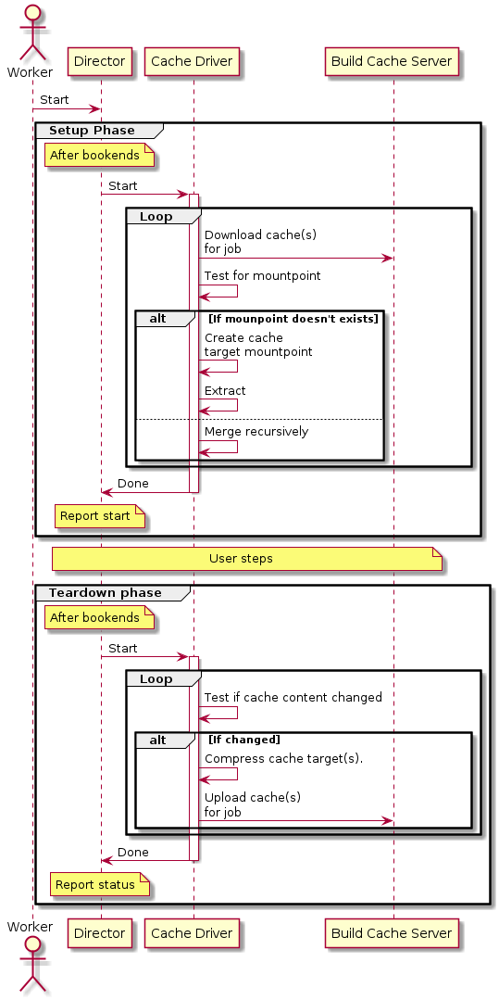

# Build cache

## Context

Users require a way to cache resources between jobs within a single pipeline or consecutive executions of a particular pipeline in order to speed up build time.

## Status

- 29 June 2018: Proposal submitted

## Proposal

Provide a mechanism for transparent caching of resources between jobs within a single pipeline, or between consecutive executions of a particular pipeline.

1. Content to be cached can be specified by the user.
2. Caching is scoped. 
   1. Job level caching
   2. Event level caching
   3. Pipeline level caching (static caching, in a sense)
3. Well used caching patterns can be offered as predefined options.
   1. Dependency caching for build systems such as npm, sbt and cargo.

The build cache and cache usage is configurable via Yaml and backed by an internal sd-command and caching service.

## Details

### Yaml specification

```yml
cache:
  # A pipeline scoped cache.
  pipeline: ["node_modules/", "~/.sbt"]
  # An event scoped cache
  event: ["target/generated-intermediate-resouce/*"]
  # A job scoped cache 
  job:
    build: ["target/some-artifact.zip"]
    publish-preview: ["target/some-artifact.zip"]
shared:
  image: rust:latest
jobs:
  test:
    requires: [~pr]
    steps:
      - test: cargo test
  build: 
    requires: [~pr]
    steps:
      - test: cargo build
  publish-preview:
    requires: [~commit]
    steps:
      - add_musl: rustup target install x86_64-unknown-linux-musl
      - build: cargo build --release --target=x86_64-unknown-linux-musl
```

### Design considerations

1. Resource usage
   1. Copying to and from a remote server for every job in a pipeline can lead to unnecessary network bandwidth usage and unnecessarily slow speeds.
2. Integrity and consistency of cached data.
3. User experience
   1. Is it easily adaptable to new use cases?
   2. Is it easily enabled and administered?
   3. Is it easily configurable by end users once enabled?
   4. Does it speed up build time? How much does it speed up build time for various use cases?
   5. Is it consistent?
   6. Is it reliable?
4. Security
   1. Is it possible to inject malicious code into pipelines via the cache mechanism? Malicious pull requests are a good example of this.

### Security

Injecting malicious code into a build via the caching mechanism is a real concern. This can lead to theft of tokens or credentials from job, or in even lead to malicious code being deployed to a production environment. 

Pull requests, as the main vector for injection of malicious code, require additional security considerations. Pull requests therefore treat caches as read-only. 

Caching of potentially sensitive data also needs to be handled. Data provided via the secrets field should not be cached. 

### Cache invalidation

- The user should also be able to invalidate caches via the UI.
- Caches get invalidated and updated when there has been a change in the checksum of the caching target.

### Conflicts

### On the build node

Multiple caches trying to restore the same content can result in unpredictable behaviour.  Caches are applied in the following order:

1. Pipeline scope
2. Event scope
3. Job scope
 1. Ordered as they are ordered in the referencing job definition.
 
 Cache extraction is a serial process.

### On the server

The build cache server implementation must be able to handle multiple concurrent write requests for the same cache. Only the last write must be persisted.

### Scoping

Job level scoping limits the cache to particular jobs, within a single pipeline. Event level scoping limits the cache to a single event within a pipeline. Pipeline level scoping represents a globally scoped cache for the single pipeline, with the cache being available for all jobs of the pipeline.

#### [Tentative] Regarding commits, branches and scoping

Caching needs to take into account commits and branches when performing scoping.

Scoping a cache to commit level and/or not considering branches will lead to issues with caching in the following instances:

- Build and create cache when deploying/build for commit in dev branch. Same cache gets matched when building commit for production branch, however production actually dynamically generates different resources/artifacts.
- Have a single commit that gets deployed from a single PR or branch with multiple configurations.

Scoping should therefore take into account:

1. Branch
2. Commit
3. Hash signature of content to be cached

#### Job level

This level of caching explicitly links a cache to certain jobs.

Use when:

1. Build dependencies take a long time to resolve
1. Injecting the cached resources into every job is desirable. Example `node_modules` directory for a nodejs project

#### Event level

Event level scoping is scoped to a single pipeline execution event. Cached data is visible and accessible to all jobs within a single execution of the pipeline.

Executions of a pipeline for the same commit are viewed as different executions.

Use when:

1. Generated resources are time dependent
2. Generated resources are only valid for single execution
3. Generated resources are meant for deployment (Please note that triggering deployment with a detached job will create a new event and, by extension, cache.)

#### Pipeline level

Pipeline level scoping is scoped to a pipeline as a whole. Cached data is visible and accessible to all instances of the pipeline.
 
Note: Concurrency for simultaneous builds need proper attention.

Use when:

1. Build dependencies take a long time to resolve
2. Generated resources are meant for deployment (Risk prone, not recommended unless deleting deployed artifact from cache after deployment)

### (Proposal) Local and remote caching

Pipeline and event level caches are stored on the build cache service node. They are copied to the build node on pipeline setup, and back to the build cache on pipeline completion.

Once copied to the build node, they are persisted as a shared volume, mounted onto the appropriate path in the build container. 

This proposal is currently blocked by the nature of the backend implementation for nodes. The k8s executor for example, selects a completely random node for every job in the pipeline. Caching locally is therefore not viable at the moment.

### Build cache service

The build cache service is essentially a specialized version of the store service. It utilizes the builtin Hapi cache system backed by Catbox. 

### Implementation details

#### Execution flow



#### Server

##### API

| Method | URL | Body | Response |
| - | - | - | - |
| GET | /pipeline/:pipeline_id/cache/:cache_id | none | A single cache entity.<br><b>Body</b><br>```{ "scope": "", "event_id": "", "pipeline_id": "", "ttl": 100,"data": base64}``` <br><b>Codes</b><br> 200, 404 |
| GET | /pipeline/:pipeline_id/cache | none | List of currently valid caches for the pipeline.<br><b>Body</b><br>```[{ "scope": "", "event_id": "", "pipeline_id": "", "ttl": 100,"data": base64}]``` <br><b>Codes</b><br> 200, 404 | 
| PUT | /pipeline/:pipeline_id/cache | ```{ "scope": "", "event_id": "", "pipeline_id": "", "data": base64``` | <b>Codes</b><br>202, 403 |

The server implementation should consider the following points:

- The data field might better be implemented as a link to a location like s3. 
- The server should use a simple LRU implementation for cache evictions.
- The server has a maximum amount of storage space for use by the cache.
- The server places a maximum limit on the amount of cache space available to each pipeline. This is a separate limit from the global maximum cache size limit.
- The server might want to consider putting simple rate limitation and concurrency controls in place.

#### Build node

##### Command

This is not exposed as a user command, but used internally by the director. It uses the pipeline definition data for cache details.

| Command | Details |
| - | - |
| `cache` | Cache command |
| `cache get` | Gets all cache for this pipeline and extracts/merges them |
| `cache put`| Saves all caches for this pipeline |


