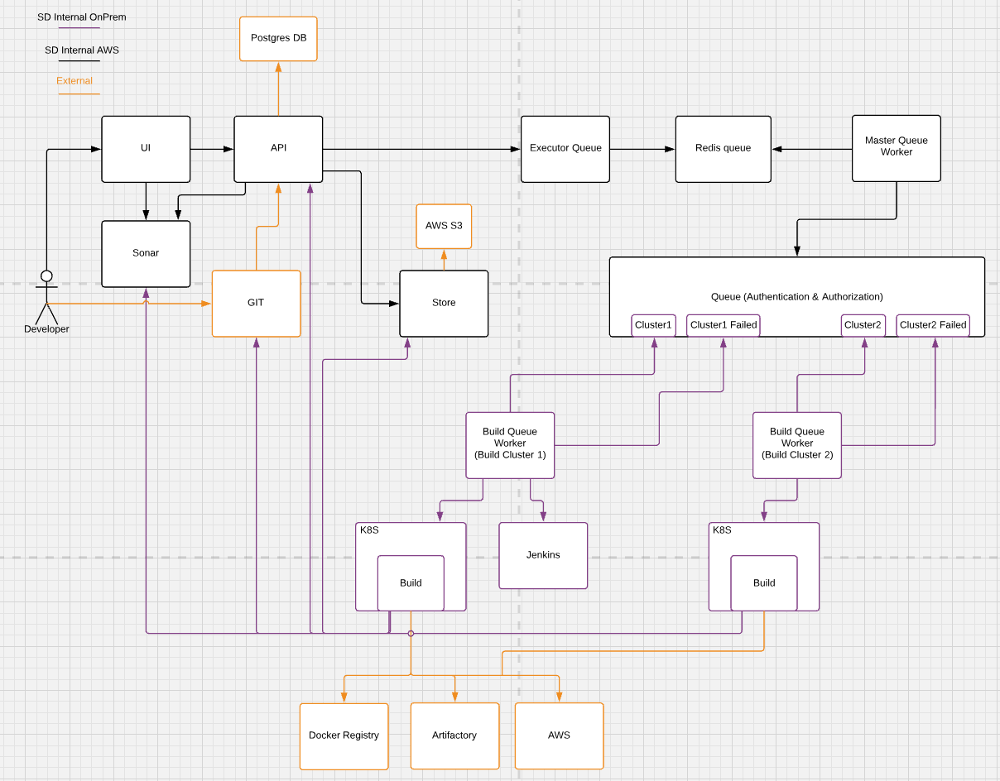

# Multiple Build Cluster 

## Context

Build a scalable Screwdriver build infrastructure. 

## Objective 

1. Running builds in multiple build clusters to support high availability
2. Users can bring in their own build clusters for their own specific infrastructure needs.
3. Support build cluster in AWS

## Proposal

1. Implicit build clusters
	Screwdriver maintains its own multiple build cluster infrastructure.

2. Explicit build clusters
	Users can bring in their own build cluster infrastructure. 
	
This can also be Screwdriver maintained specialized cluster where all users have access. Eg: Mobile iOS cluster or Windows cluster.
	

As part of cluster onboarding process for above both options cluster admin should register their build cluster information with Screwdriver. Below details are required to register a build cluster.

	1. Cluster name - Cluster name provided by the client
	2. isActive - Cluster status whether its active or inactive. This will be used to route / pause. Initially this will be a manual update of cluster health.
	3. Authorization - Authorize using user credentials and queue details.
	4. SCM Context - git url (github.com). Applicable to only explicit build clusters which are non SD maintained.
	5. SCM Organization - git organizations. Will be used to validate if job has permission to run on build cluster which is requesting. Applicable to only explicit build clusters which are non SD maintained.
	6. defaultCluster (true / false) - if true Cluster is maintained by screwdriver team, false cluster is maintained by external team.  


## Design




### Responsibilities
	1. No change in current API to Redis implemention  
	2. Master queue worker will push build job to queue from redis, after successfully validating blockedBy and other checks.
	3. Build cluster queue worker will consume/poll from its respective queue.
	4. Queue authorization (acls) will authorize the build cluster queue worker request.


### Authentication & Authorization

Master queue worker to queue - Master queue worker will be authorized with admin privileges to access all queues.  

Build cluster queue worker to queue - build cluster will be registered and authorized to a queue or set of queues. Queue worker from build cluster will connect to queue using authorized user credentials and consume jobs from the queue on successful authorization.   


### Queue setup
TBD

### Yaml 

```yml
shared:
    environment:
    NODE_ENV: test
    settings:
        email:
    addresses: [test@email.com, test2@email.com]
    statuses: [SUCCESS, FAILURE]
    annotations:
        buildCluster: iOS
jobs:
    main:
        requires: [~pr, ~commit]
        sourcePaths: ["src/app/", "screwdriver.yaml"]
        image: node:6
        steps:
    - init: npm install
    - test: npm test
    publish:
    requires: main
    image: node:6
    steps:
        - publish: npm publish
    ...
```


### New table for build cluster details

Table: `buildCluster`

Columns:

| Name | Type | Nullable | Primary Key | Unique | Description
| --- | --- | --- | --- | --- | --- |
| `id` | integer | no | yes | yes | |
| `name` | text (100) | no | no | yes | |
| `scmOrganizations` | text(500) | yes | no | no | |
| `scmContext` | text(200) | no | yes | no | |
| `isActive` | boolean | no | no | no | *false or true* |
| `defaultCluster` | boolean | no | no | no | *true - cluster maintained by screwdriver team, false - cluster maintained by  external team * |
| `maintainer` | text(100) | yes | no | no | cluster admin email for communications |
| `weightage`| smallint | yes | no | no | weighted percentage to route jobs; applicable only to screwdriver cluster; default 100


Unique constraint: `name` 

#### Sample record

| id | name | scmContext | scmOrganizations | isActive | defaultCluster | maintainer | weightage
| --- | --- | --- | --- | --- | --- | --- | ---
| 1 | gq1 | github:github.com | null | true | true | sd@foo.com | 70
| 2 | bf1 | github:github.com | null | false | true | sd@foo.com | 30
| 3 | iOS | github:github.com | [iOS_org1, iOS_org2] | true | false | ios@foo.com | 100

### Below listed apis need to be built to manage the cluster details

| Method | url | Description
| --- | --- | ---
| `POST` | ` /buildClusters ` | ` { "name":"iOS", "scmContext":"github:github.com", "scmOrganizations": "[iOS_org1, iOS_org2]", "isActive":true, "defaultCluster": true } `
| `GET` | `	/buildClusters ` | ` get list of buildClusters info `
| `GET` | `	/buildClusters/:name ` | ` get a particular buildCluster info `
| `DELETE` | ` /buildClusters/:name ` | ` delete buildCluster `


### Cluster on-board

1. Build cluster admin requesting access with cluster info and user credentials
2. SD admin to populate buildCluster table with cluster info 
3. SD admin to create queue based on #1
4. SD admin authorize build cluster user and queue 


## Flow
### SD Validator

	1. SD validator should validate if the annotated buildCluster in yaml is onboarded and active. 
	
### API to Redis

	1. No change in existing implementation.

### Model

	1. Query `buildClusters` table for active records with cluster name from build info 
	2. Validates if build job can be scheduled in specified buildCluster queue by validating scmContext + scmOrganization access. 
	3. one (or) more record exist, then assign job to the queue based on the weighted percentage of cluster
	4. no records, then query `clusters` table for active records with defaultCluster=true
	5. repeat step #3
	6. Update build info with cluster and queue details

### Master queue worker to Queue 

	1. Poll build job from Redis, Validate blockedBy and other checks are successful and push the build to appropriate queue as specified in build message.

### Build cluster Queue worker   
    
	1. Build cluster queue worker will consume/poll jobs from queue. 
	2(a). On successful authorization, job will be consumed. 
	2(b). On authorization failures, queue will reject consume/poll request.
	3. Jobs will be processed in build cluster.
	3(a). On successful acknowledgement in build cluster, offset will be committed and step #1 will be repeated.
	3(b). On acknowledgement failures in build cluster, process will be retried for specific # of times before giving up and Offset will be committed and step #1 will be repeated.

	note: in future, 3(b) will be changed to implement failure queues and process messages from failure queues


	