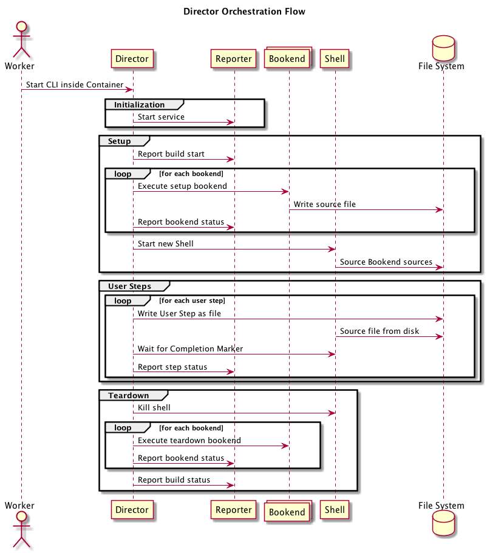

# Director (Build Flow)

## Context

Running a user's commands inside their container is _the_ point of Screwdriver.  This document describes the expected control flow of a build, specifically how each component interacts with each other.

## Status

 - 14 September 2017: Proposal submitted

## Proposal

A single interface to launch and manage the commands a user expects to run inside a container that we don't control.

```bash
$ sd_director --api-uri https://api.screwdriver.cd --build-id 12345 --build-jwt {...}
```

Here is the high-level overview:

 1. **Initialization** - Start required services and load information about the build.
 2. **Setup** - Ensure the environment is configured and loaded (git clone, environment variables, etc.).
 3. **User Steps** - Run all user steps inside a single shell.
 4. **Teardown** - Capture artifacts and publish final status.

And here is the process overview:

```bash
[container-init]
\_ /sd/bin/sd_director --api-uri "..." --build-id "..." --build-jwt "..."
  \_ /sd/bin/sd_reporter --socket "..." &
  \_ ./setup-bookend-1
  \_ ./setup-bookend-2
  \_ /bin/sh [... load env from file]
  | \_ ./load-bookend-1-env
  | \_ ./load-bookend-2-env
  | \_ ./user-step-1
  | \_ ./user-step-2
  \_ ./teardown-bookend-1
  \_ ./teardown-bookend-2
```

## Details



### Initialization

1. **Director** is started via Executor on container start (includes API URI, **Build JWT**, and Build ID).
2. Build information (user steps, bookends, environment, etc) is loaded from the API.
3. **Control JWT** is acquired from the Auth server using the **Build JWT**.
3. **Reporter** is started with a UNIX socket for communication.
4. **Control JWT** and Build ID is sent to **Reporter** over UNIX socket.
5. **Workspace** directories are created.
6. **Reporter** is notified that the build is starting.

### Setup

1. Each setup **Bookend** is executed directly (with **Control JWT** and **Environment Variables**) with `STDOUT` and `STDERR` sent to the **Reporter**.
2. New Shell `/bin/sh` is started and preloaded with **Environment Variables** with `STDOUT` and `STDERR` sent to the **Reporter**.
3. Each **Bookend** output script is sourced inside that shell (to pre-load environment variables or change directories).

### User Steps

_These operations are run for each **User Step**_

1. **Reporter** is informed that a new step is starting.
2. **User Step** command is written to a temporary file.
3. Temporary file is sourced into the running shell along with a **Completion Marker**.
4. Once the **Completion Marker** appears, **Reporter** is informed that the step completed.
5. If the shell is still running, continue to next **User Step**.

### Teardown

1. Shell is closed (if not already closed).
2. Each teardown **Bookend** is executed directly.
3. **Reporter** is notified that the build is complete.

## Appendix

### Environment Variables

These are the additional environment variables we will be setting during any command that is executed in a build.

- `SD_BUILD_ID` - Internal identifier of the Build
- `SD_JOB_ID` - Internal identifier of the Job
- `SD_JOB_NAME` - Human readable name of the Job
- `SD_PIPELINE_ID` - Internal identifier of the Pipeline
- `SD_BUILD_JWT` - See terminology section below
- `SD_CONTROL_JWT` - See terminology section below
- `SD_ROOT_DIR ` - See terminology section below
- `SD_BOOKEND_DIR ` - See terminology section below
- `SD_COMMAND_DIR ` - See terminology section below
- `SD_SOURCE_DIR ` - See terminology section below
- `SD_WORKSPACE_DIR` - See terminology section below

### Workspace Directories

To prevent collision with the data inside the user's container, Screwdriver will store data inside it's own root directory:

| **Directory** | **Purpose** | **Environment Variable** |
|---------------|-------------|--------------------------|
| `/sd` | Screwdriver safe space | `SD_ROOT_DIR` |
| `/sd/bookends` | **Bookend** write location | `SD_BOOKEND_DIR` |
| `/sd/commands` | Downloaded **Commands** | `SD_COMMAND_DIR` |
| `/sd/workspace` | User safe space | `SD_WORKSPACE_DIR` |
| `/sd/workspace/src/...` | Checked out source code | `SD_SOURCE_DIR` |

### Terminology

 - **Image** - A container image (generally Docker) that the build runs in.
 - **Management Tools** - Container with required binaries for builds, including Director, Reporter, and Meta CLI.
 - **Director** - Screwdriver's command execution director.
 - **Reporter** - Tool used for reporting back logs and current status.
 - **Meta CLI** - Tool that can read & write global job state.
 - **Store CLI** - Tool that can read & write to the artifact store.
 - **Bookend** - A self-contained binary command that runs before or after the user's defined commands.
 - **Workspace** - A non-conflicting directory that all Screwdriver operations occur in.
 - **Environment Variables** - Key/Values to set as defined by the Screwdriver.yaml mixed with the values that help identify what this build is (ID, JWT, Pipeline, Job, Workspace Directory).
 - **User Steps** - Shell commands to execute that are defined in the Screwdriver.yaml.
 - **Completion Marker** - Unique identifier to know when the previous User Step finished executing.
 - **Build JWT** - 12h JSON Web Token that identifies that this is the build.
 - **Control JWT** - 12h JSON Web Token that allows the Director, Reporter, and Bookends to write to the API and Store.
