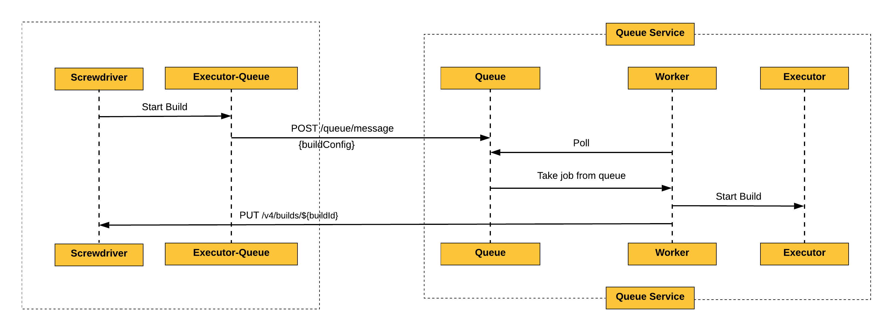
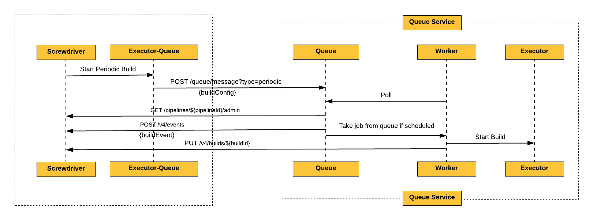

# Queue Service

## Context

This is a highly available REST based queue service for screwdriver to enqueue builds and process them.
It makes use of [Resque][node-resque-URL] to add a queueing mechanism.

#### Problem

In existing structure, executor is tightly coupled with screwdriver api and it constantly polls for
jobs which causes blocking in the api requests. Also, if the api crashes this can cause scheduled jobs
not being added to queue and causing failures. To avoid such issues we need a resilient queuing system whcih puts and deletes messages from queue and acts as scheduler. 

The rest of this document will describe the overall architecture of the highly available and resiliant queuing service.

## Design Decisions

### Requirements

* Appropriate license (Apache 2.0)
* Includes plugins to prevent duplicates from entering the queue
* Handles large queue size
* Allows for thousands of queries per seconds (queues and dequeues quickly)
* Support for logging, stats, and metrics
* Distributed load
* Persistent
* Allows for prioritization
* Password-protected security
* Decoupled queueing system
* Highly available and resilient

# Executor Queue

## Context

This is an executor plugin for Screwdriver which acts as a wrapper to make API calls
to the queue service, thereby giving a pluggable interface in executor.

#### Node-resque Executor

| Screwdriver Executor Task | node_resque Equivalent(s) | Queue Service API
| ------------------------- |---------------------------|--------------------------------------
| Start                     | queue.enqueue(queue, job, args) | POST /queue/message
| Stop (job in queue)       | queue.del(queue, job, args, callback) | DEL /queue/message
| Stop (job in execution)   | API call to the worker?* | POST /queue/message
| Status (job in queue)     | - queue.queued (.filter)   - Add another data structure** | GET /queue/message?jobId=
| Status (job in execution) | - Add another data structure** | GET /queue/message?jobId=
| Stats                     | - queue.stats (number of jobs completed)   - queue.queued (things in the queue)   - queue.allWorkingOn (status of all workers)   - queue.failed, queue.failedCount (# and info on failed jobs)   - Add another data structure** (jobs in execution) | GET /queue/stats

### Sequence Diagrams

### Starting a build

### Starting a periodic/frozen build
