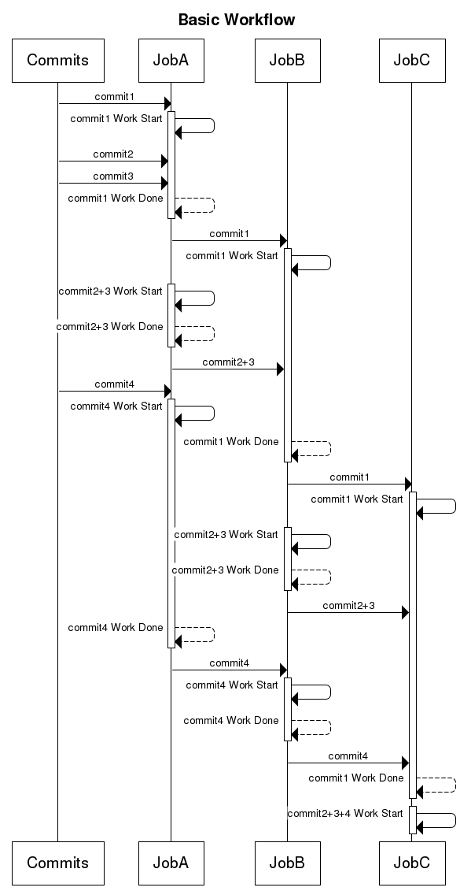

# Executor Queue

## Context

This is an executor plugin for Screwdriver that makes use of [Resque][node-resque-URL] to add a queueing mechanism.

### Problem

Right now, Screwdriver directly calls the executor when a build needs to be started. If the executor target is offline or full, the build is generally dropped with an error message. This isn't a good user experience, especially if the error is hidden due to the build being started from a PR or commit.

Instead, Screwdriver should be pushing planned builds into a queue; all available executors should be listening on that queue and taking items off when they have capacity. This will allow us to distribute between N number of Docker Swarm clusters, for example.


## Architecture Overview


## Sequence Diagrams

### Starting a build


## Design Decisions

### Router

The `executor-queue` will sit behind `executor-router` until it works as we expect, so as not to disturb people already using `executor-router`. Once the queue is functional the router will be removed, with the queue serving both purposes.

## Planned Functionality

### Triggers (triggered_by/rebuild_on)


When build A finishes successfully, build B starts. When build B finishes successfully, build C starts.

```yaml
workflow:
  - A
  - B
  - C
```

UML: See collapse builds/commits

### Join


When build A finishes successfully,  build B and build C start. When build B and build C both finish successfully, build D starts.

Workflow:

```yaml
workflow:
  - A
  - parallel:
    - B
    - C
  - D
```

### Collapse


If COMMIT1 is merged it triggers build A1 to start. If COMMIT2 and COMMIT3 are merged while A1 is still building, their corresponding A builds will be collapsed into one: build A3, which will be put into the queue. Once build A1 has completed, A3 will start. If COMMIT4 is merged while B3 is building, the workflow will be as normal as long as the same jobs don’t run at the same time. If they are, they will be collapsed into the most recent commit event.

Workflow:

```yaml
workflow:
  - A
  - B
  - C
```




If JobD were a very long running task, it could also collapse multiple sets of join event results, just like JobA can collapse incoming commit triggers.

### Detached Jobs


Detached jobs are standalone jobs, or are not automatically triggered by commits. This gets into a realm of multiple distinct workflows, and is not yet well-defined. See also Build Periodically for an example UML.

Workflow:

```yaml
workflow:
  - B
  - C
jobs:
  A:
    detached: true
  B:
    detached: true
```

### Freeze Windows

Jobs will not start except during a user configured time period. Jobs will be queued outside of that time period and run when the window is open.


### Build Periodically

Jobs will run on a user defined schedule.


### Delay

Jobs will be queued normally and will remain in queue for a configurable amount of time, even if there are free executors. Current use case: load a bunch of information in the grid and need to wait for it to process


### Matrix Jobs

Matrix jobs will work very similarly to join/parallel builds.


## Contributing

If you make changes to the architecture, please be sure to update this document. To update any architecture diagrams rendered from `.puml` files, just run `npm run diagrams` (you will need to have [graphviz](http://graphviz.org/) installed locally). To update diagrams generated from `.wsd` files use [web sequence diagrams](https://www.websequencediagrams.com/).

## Resources
* [node-resque][node-resque-URL]
* [resque-bus][resque-bus-URL]
* [Wikipedia: Readers-writer Lock](https://en.wikipedia.org/wiki/Readers%E2%80%93writer_lock)
* [Resque Workers Lock](https://github.com/bartolsthoorn/resque-workers-lock)

[node-resque-URL]: https://github.com/taskrabbit/node-resque
[resque-bus-URL]: https://github.com/queue-bus/resque-bus
