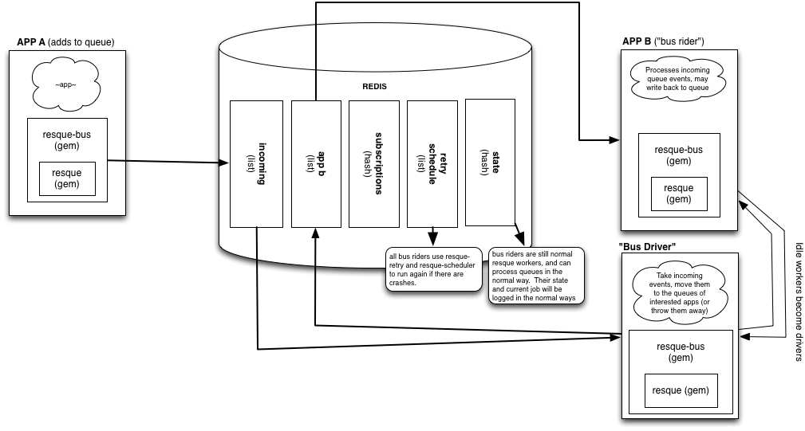

# Executor Queue

## Context

This is an executor plugin for Screwdriver that makes use of [Resque][node-resque-URL] to add a queueing mechanism.

#### Problem

Right now, Screwdriver directly calls the executor when a build needs to be started. If the executor target is offline or full, the build is generally dropped with an error message. This isn't a good user experience, especially if the error is hidden due to the build being started from a PR or commit.

Instead, Screwdriver should be pushing planned builds into a queue; all available executors should be listening on that queue and taking items off when they have capacity. This will allow us to distribute between N number of Docker Swarm clusters, for example.

The rest of this document will describe the overall architecture of the executor queue, as well as of the various plug-ins that will eventually be built on top of it.

## Design Decisions

### Requirements

* Appropriate license (Apache 2.0)
* Includes plugins to prevent duplicates from entering the queue
* Handles large queue size
* Allows for thousands of queries per seconds (queues and dequeues quickly)
* Support for logging, stats, and metrics
* Distributed load
* Persistent
* Allows for prioritization
* Password-protected security

### Why Node-Resque?

We evaluated numerous queueing mechanisms based on the acceptance criteria above. We eventually settled on [resque](resque-URL), and specifically [Node-resque](node-resque-URL), because it meets all the requirements above and fits in well with the rest of our codebase. In addition, the community around it is pretty active, and we should easily be able to implement a variety of plugins for the queue.

#### Node-resque Plugins

A plugin has access to four unique hooks:
* `before_enqueue` - Called with the job args before a job is placed on the queue. If the hook returns `false`, the job will not be placed on the queue.
* `after_enqueue` - Called with the job args after a job is placed on the queue. Any exception raised propagates up to the code which queued the job.
* `before_perform` - Called with the job args before perform. If it raises
  `Resque::Job::DontPerform`, the job is aborted. If other exceptions
  are raised, they will be propagated up the the `Resque::Failure`
  backend.
* `after_perform` - Called with the job args after it performs. Uncaught
  exceptions will propagate up to the `Resque::Failure` backend.

More information about node-resque plugins can be found [here](node-resque-plugins-URL).

#### Node-resque Executor

| Screwdriver Executor Task | node_resque Equivalent(s) |
| ------------------------- |---------------------------|
| Start                     | queue.enqueue(queue, job, args) |
| Stop (job in queue)       | queue.del(queue, job, args, callback) |
| Stop (job in execution)   | API call to the worker?* |
| Status (job in queue)     | - queue.queued (.filter) </br> - Add another data structure** |
| Status (job in execution) | - Add another data structure** |
| Stats                     | - queue.stats (number of jobs completed) </br> - queue.queued (things in the queue) </br> - queue.allWorkingOn (status of all workers) </br> - queue.failed, queue.failedCount (# and info on failed jobs) </br> - Add another data structure** (jobs in execution) |

\* Worker.end() will tell the worker to finish whatever job it’s working on, and then not take on any further work after that completes. To shut down a job that’s in flight seems to require something else.

\** For status, we can get a list of all jobs in the queue, and then filter by buildId. For jobs that are in progress, we will need to add some additional data structure in redis implementing a map from job ID to status and having workers update that as they pick up and finish tasks.

### Router

As an MVP, the `executor-queue` will sit behind `executor-router` until it works as we expect, so as not to disturb people already using `executor-router`. Once the queue is functional the router will be removed, with the queue serving both purposes.

### Detecting Duplicates (not implemented yet)

Jobs cannot have multiple builds running at the same time. We can modify the jobLock plugin implemented in node-resque to only compare the `jobId` (currently, the plugin evaluates uniqueness by looking at the entire payload).

Alternatively, we can use the `blocked_by` plugin once we've implemented that.


### Pub-Sub Investigation (using [node-queue-bus][node-queue-bus-URL])



Actors:
* Publisher: thing that emits/sends the message
* Subscriber: associates a message to a queue
* 2 types of workers:
  * Broker: Routes & replicates a message to the correct queue
  * Normal: Processes the job

Queues:
* Incoming - landing queue for all events
* Subscriptions
* Retry schedule
  * Schedules jobs either at a specific time (scheduled job) or amount of elapsed time since job was scheduled (delayed job)
* State
  * State of workers and their processing jobs

[Proof of Concept](https://gist.github.com/FenrirUnbound/0d9fd27cc5280814e5d9cd2b47008da8)

Caveat:
* Job definitions cannot be dynamically defined
  * Jobs are a hash, where the key is the job name and the value is a function to execute that processes the payload. When you instantiate a worker, you give it the hash. If a worker accepts a payload that is supposed to be processed by a job not in its initial hash, it'll crash and the job payload is lost (recovering the job requires an additional workflow for us to define)
* Jobs must be defined before the worker is put into service.
  * If a job definition needs to be updated, the worker needs to be taken out of rotation.
* Best recommendation: 1 worker per Screwdriver job

Notes:
* Only the publisher & workers have access to stateful information (or can create stateful information)
* Subscriber cannot be subscribed to an event and attach state to it. E.g., a subscriber can only say “fire this job if this message is in the message bus”, and not “fire this job with this additional metadata if this message is in the message bus”
* Subscriber state must be maintained elsewhere, either in specialized workers or a DB
  * Workers could have a specific job that subscribes to events
    * This means that workers must have that job defined before processing
* rebuild_on/triggered_by: need message bus with heavy modifications to maintain state somewhere
* Blocked_by: use the jobLock or use message bus
  * When job A is started, subscribe to job A with everything that is blocked by it
* Join triggers/parallel: need message bus
* Matrix: publisher tells the subscriber/driver(?) what permutations to make -> workers will process each permutation
  * How do you know when all the matrix jobs are done? (parallel/join stuff)

## Architecture Overview (MVP)


## Sequence Diagrams

### Starting a build


## Planned Functionality

### Blocked_by

Similar logic to [jobLock](https://github.com/taskrabbit/node-resque/blob/master/lib/plugins/jobLock.js#L30-L38).

If jobC is blocked_by jobA and jobB:
- In the before_perform hook, keeps polling jobA & jobB every x seconds
- If both are not done, reEnqueue jobC
- If both are done, return

### Triggers (triggered_by/rebuild_on)


When build A finishes successfully, build B starts. When build B finishes successfully, build C starts.

```yaml
workflow:
  - A
  - B
  - C
```

UML: See collapse builds/commits

### Join


When build A finishes successfully,  build B and build C start. When build B and build C both finish successfully, build D starts.

Workflow:

```yaml
workflow:
  - A
  - parallel:
    - B
    - C
  - D
```


### Collapse


If COMMIT1 is merged, it triggers build A1 to start. If COMMIT2 and COMMIT3 are merged while A1 is still building, their corresponding A builds will be collapsed into one: build A3, which will be put into the queue. Once build A1 has completed, A3 will start. If COMMIT4 is merged while B3 is building, the workflow will be as normal as long as the same jobs don’t run at the same time. If they are, they will be collapsed into the most recent commit event.

Workflow:

```yaml
workflow:
  - A
  - B
  - C
```


When jobs are run in parallel for a join operation, the joined jobs act as one unit, not triggering the next job until both have successfully completed. Jobs that trigger a parallel join, or are triggered by a parallel join could collapse their triggers.


If JobD were a very long running task, it could also collapse multiple sets of join event results, just like JobA can collapse incoming commit triggers.

### Detached Jobs


Detached jobs are standalone jobs, or are not automatically triggered by commits. This gets into a realm of multiple distinct workflows, and is not yet well-defined. See also Build Periodically for an example UML.

Workflow:

```yaml
workflow:
  - B
  - C
jobs:
  A:
    detached: true
  B:
    detached: true
```

### Freeze Windows

Jobs will not start except during a user configured time period. Jobs will be queued outside of that time period and run when the window is open.


### Build Periodically

Jobs will run on a user defined schedule.


### Matrix Jobs

Matrix jobs will work very similar to join/parallel builds.


## Contributing

If you make changes to the architecture, please be sure to update this document. To update any architecture diagrams rendered from `.puml` files, just run `npm run diagrams` (you will need to have [graphviz](http://graphviz.org/) installed locally). To update diagrams generated from `.wsd` files use [web sequence diagrams](https://www.websequencediagrams.com/).

## Resources
* [Resque Workers Lock](https://github.com/bartolsthoorn/resque-workers-lock)
* [Wikipedia: Readers-writer Lock](https://en.wikipedia.org/wiki/Readers%E2%80%93writer_lock)
* [node-resque][node-resque-URL]
* [resque-bus][resque-bus-URL]

[node-queue-bus-URL]: https://www.npmjs.com/package/node-queue-bus
[node-resque-URL]: https://github.com/taskrabbit/node-resque
[node-resque-plugins-URL]: https://github.com/taskrabbit/node-resque#plugins
[resque-URL]: https://github.com/resque/resque
[resque-bus-URL]: https://github.com/queue-bus/resque-bus
