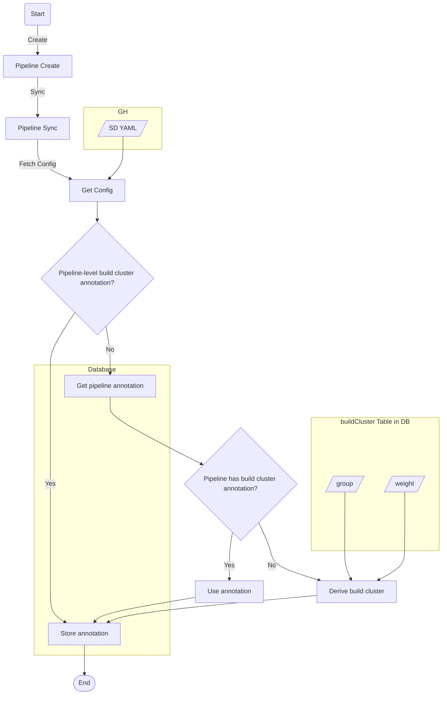
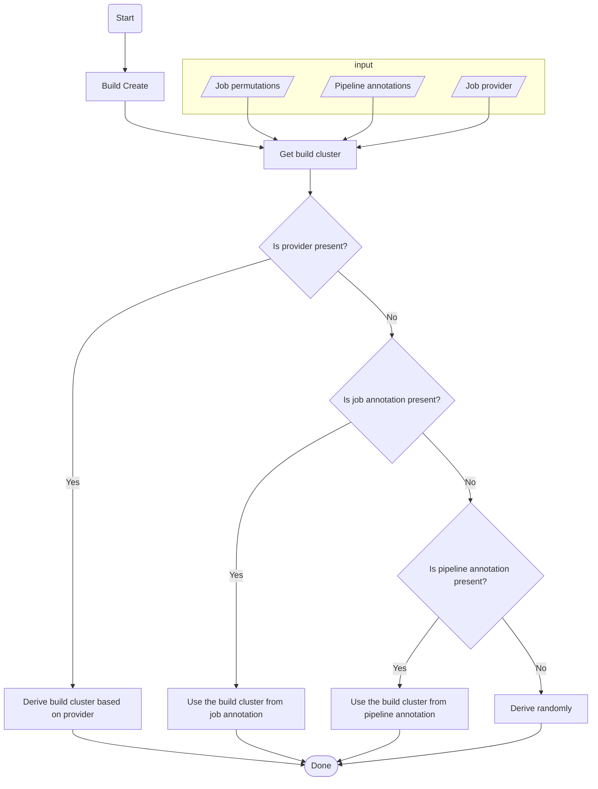

### Build Cluster Selection

##### On pipeline creation

```mermaid
graph TD

  A(Start) -->|Create| B[Pipeline Create]
  B -->|Sync| C[Pipeline Sync]
  C -->|Fetch Config| D[Get Config]

  subgraph GH
    E1@{ shape: lean-r, label: "SD YAML" }
  end
  E1 --> D

  D --> E{Pipeline-level build cluster annotation?}
  E -->|Yes| F[Store annotation]
  E -->|No| F1[Get pipeline annotation]

  subgraph Database
    F1
    F
  end

  F1 --> H{Pipeline has build cluster annotation?}
  H -->|Yes| I[Use annotation] --> F
  H -->|No| J[Derive build cluster] --> F
  F --> Z@{ shape: stadium, label: "End" }

  subgraph buildCluster Table in DB
    K@{ shape: lean-r, label: "group" }
    L@{ shape: lean-r, label: "weight" }
  end

  K --> J
  L --> J

  click B "https://github.com/screwdriver-cd/screwdriver/blob/master/plugins/pipelines/create.js"
  click C "https://github.com/screwdriver-cd/screwdriver/blob/5a74c24e232a95a12d28e0ae7c4c3a5b25e6f872/plugins/pipelines/create.js#L104"
  click D "https://github.com/screwdriver-cd/models/blob/7eac5d79e11620793ab8936cf6e06971a2c04eea/lib/pipeline.js#L1009-L1021"
  click I "https://github.com/screwdriver-cd/models/blob/7eac5d79e11620793ab8936cf6e06971a2c04eea/lib/pipeline.js#L1018-L1020"
  click J "https://github.com/screwdriver-cd/models/blob/7eac5d79e11620793ab8936cf6e06971a2c04eea/lib/helper.js#L229-L293"

```

##### On build creation

```mermaid
graph TD

  A(Start) --> B[Build Create]
  B --> C[Get build cluster]
  subgraph input
  D@{ shape: lean-r, label: "Job permutations" }
  E@{ shape: lean-r, label: "Pipeline annotations" }
  F@{ shape: lean-r, label: "Job provider" }
  end
  D --> C
  E --> C
  F --> C
  C --> G{Is provider present?}
  G -->|Yes| H[Derive build cluster based on provider]
  H --> Z@{ shape: stadium, label: "Done" }
  G -->|No| I{Is job annotation present?}
  I --> |Yes| J[Use the build cluster from job annotation]
  J --> Z
  I --> |No| K{Is pipeline annotation present?}
  K --> |Yes| L[Use the build cluster from pipeline annotation]
  K --> |No| M[Derive randomly]
  L --> Z
  M --> Z

  click C "https://github.com/screwdriver-cd/models/blob/7eac5d79e11620793ab8936cf6e06971a2c04eea/lib/buildFactory.js#L221-L226"
  click D "https://github.com/screwdriver-cd/models/blob/7eac5d79e11620793ab8936cf6e06971a2c04eea/lib/buildFactory.js#L213"
  click E "https://github.com/screwdriver-cd/models/blob/7eac5d79e11620793ab8936cf6e06971a2c04eea/lib/buildFactory.js#L214"
  click H "https://github.com/screwdriver-cd/models/blob/7eac5d79e11620793ab8936cf6e06971a2c04eea/lib/helper.js#L245-L248"
  click I "https://github.com/screwdriver-cd/models/blob/7eac5d79e11620793ab8936cf6e06971a2c04eea/lib/helper.js#L235-L237"
  click L "https://github.com/screwdriver-cd/models/blob/7eac5d79e11620793ab8936cf6e06971a2c04eea/lib/helper.js#L239-L241"
  click M "https://github.com/screwdriver-cd/models/blob/7eac5d79e11620793ab8936cf6e06971a2c04eea/lib/helper.js#L259-L265"
```
