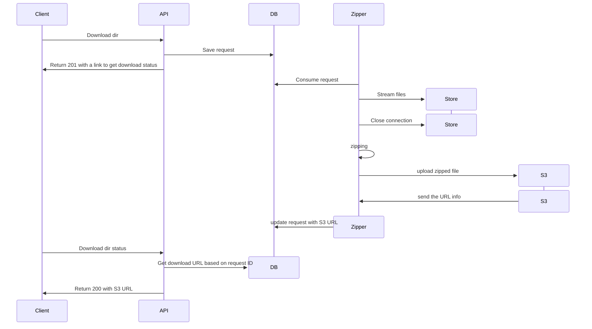
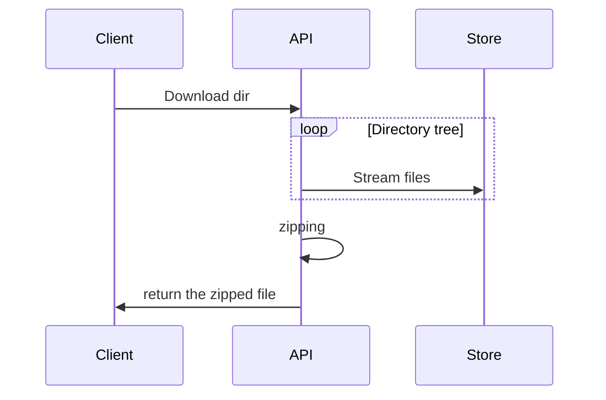

# SD Download Zipped Artifacts

#### Context

The current [API endpoint](https://github.com/screwdriver-cd/screwdriver/blob/master/plugins/builds/artifacts/get.js) allows downloading artifacts for a single file. This is quite limited, as users often need to download multiple files simultaneously.

#### Proposal

###### Asynchronous Implementation (preferred for a foolproof solution)

###### Async Implementation Flows

1. User requests to download a directory.
2. The client sends a download directory request to the API.
3. The API saves the request in the database.
4. The API returns a 201 response to the client with a link to check the download status.
5. The Zipper service consumes the request from the database.
6. The Zipper service calls Store and streams the files from the store.
7. The Zipper service starts zipping the streamed files.
8. The Zipper service uploads the zipped file to S3.
9. The S3 sends the URL information back to the Zipper service.
10. The Zipper service updates the request in the database with the S3 URL.
11. The client sends a request to check the download directory status to the API.
12. The API retrieves the download URL based on the request ID from the database.
13. The API returns a 200 response to the client with the S3 URL.

###### Synchronous Implementation (fast development time)

###### Synchronous Implementation Flows

1. User requests to download a directory.
2. The client sends a download directory request to the API.
3. The API begins streaming the files from the store in a loop, recursively traversing the entire directory tree.
4. The API zips the streamed files.
5. The API returns the zipped file to the client.
6. The client receives the zipped file.

#### Design Caveat

Depending on the number of files being streamed, there’s a potential risk of running into memory issues. To prevent this, we should implement a check to estimate the total download size, such as 1GB.
