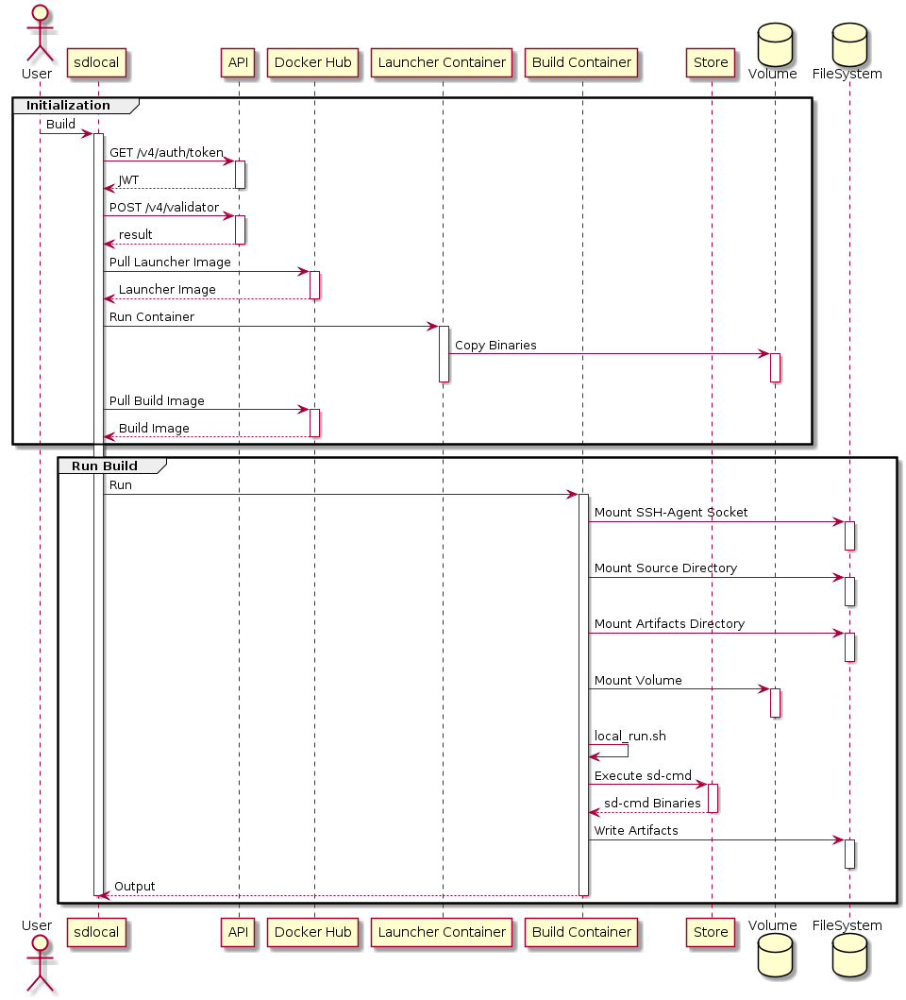

## Context
The build environment on Screwdriver.cd differs from the user execution environment in the following ways:
- `sd-step` is available
- Template is available
- Metadata is available
- Guarantee build reproducibillity

Therefore, the build results may differ between the build environment on local and the build environment on Screwdriver.cd.
As a result, User cannot confirm whether the result obtained on CI is the expected result until the build is actually run on Screwdriver.cd.

## Status
- December 3rd, 2019: Proposal submitted
- December 6th, 2019: Added `SD_META_DIR`
- December 18th, 2019: Updated `launcher` / `log-service`
- March 4th, 2020: Added `src-url option`

## Proposal

Provide the function for users to run builds locally.

A simple example is shown below

```
$ cat screwdriver.yaml
jobs:
  test:
    image: centos7:latest
    steps:
      - echo: echo "test"
$ sdlocal build test # start `test` job in screwdriver.yaml
echo "test"
test
```

## Details




### Initialization

1. Run `sdlocal build` command
2. Get JWT from API
3. Validate screwdriver.yaml
   - Validate yaml
   - Get Template/Step information
   - Merge Template／Step information and Meta／Secrets from sd-local options
   - Format in the same format as payload from `/v4/builds/{id}`. Specifically, it has the following JSON format. (ref: [type `Build` in launcher](https://github.com/screwdriver-cd/launcher/blob/master/screwdriver/screwdriver.go#L131-L140))
     ```
     {
       "id": 0,
       "environment": [
         {}
       ],
       "eventId": 0,
       "jobId": 0,
       "parentBuildId": [
         0
       ],
       "sha": "dummy",
       "meta": {},
       "steps": [
         {
           "name": "install",
           "command": "npm install"
         }
       ]
     }
     ```
4. Pull Launcher Image from Docker Hub
5. Copy the binaries under `/opt/sd/` from Launcher Container to the common volume
6. Pull Build Image from Docker Hub

### Run Build
1. Mount the following and run Build Container
   - SSH-Agent Socket
   - The common volume prepared in `Initialization` No.4
   - Source Directory
   - Artifacts Directory
2. Run Local Mode Launcher on Build Container
   - Run Launcher binary with `--local-mode` option in `local_run.sh`
   - Config Build Environment Variables and Environment Variables by env option 
   - Run Steps got in `Initialization` No.3
   - Run `sd-cmd`
     1. Get the binaries from Store
     2. Run it
3. Write Artifacts to Artifacts Directory
4. Output logs to a file under Artifacts Directory

### Build Environment Variables

- SD_JOB_NAME: The value passed as a argument
- SD_TEMPLATE_FULLNAME: The value got from validator API
- SD_TEMPLATE_NAME: The value got from validator API
- SD_TEMPLATE_NAMESPACE: The value got from validator API
- SD_TEMPLATE_VERSION: The value got from validator API
- SD_TOKEN: JWT got in `Initialization`
- USER_SHELL_BIN: Set by user, otherwise Screwdriver.cd default
- SD_META_DIR: `/sd/meta` (by default)
- SD_META_PATH: `${SD_META_DIR}/meta.json`
- SD_ROOT_DIR: `/sd/workspace` (by default)
- SD_SOURCE_DIR: `${SD_ROOT_DIR}/src/<SCM hostname>/<organization>/<repository>`
- SD_SOURCE_PATH: Generate from `screwdriver.yaml`
- SD_ARTIFACTS_DIR: `${SD_ROOT_DIR}/artifacts`
- SD_CONFIG_DIR: Not set (Need to be set when External Config is supported)
- CONFIG_URL: Not set (Need to be set when External Config is supported)
- SD_API_URL: The value got from config file
- SD_STORE_URL: The value got from config file
- CI: `false`
- CONTINUOUS_INTEGRATION: `false`
- SCREWDRIVER: `false`


## Usage

### Prerequisites
- Docker runtime

### Start build

```bash
$ sdlocal build [job-name] [options]
```

#### Input

- `job-name` the job in `screwdriver.yaml` to be run locally (default: `./screwdriver.yaml`)

##### Options

- `--meta [json]` Set values of `meta` (JSON)
- `--meta-file [path]` Path to config file of `meta` (JSON)
- `-e, --env [key=value]` Set `key` and `value` relationship which is set as environment variables of Build Container.
  - `secrets` is also set as environment variables.
- `--env-file [path]` Path to config file of environment variables. (`.env`)
- `--artifacts-dir [path]` Path to the host side directory which is mounted into `$SD_ARTIFACTS_DIR`. (default: `./sd-artifacts`)
- `-m, --memory [size]` Set memory size which Build Container can use. Either b, k, m, g can be used as a size unit. (default: ?)
- `--src-url [repository url]` Set repository URL which is to build when user use the remote repository without local files.

###### src-url option
- How to specify the URL
  - The URL can be passed with either https or ssh schema
  - To specify the branch, we can add a `#<branch>` suffix to the url
  - ex) `--src-url git@github.com:foo/bar#baz`

#### Output

- Logs of all executed steps in the job to `$SD_ARTIFACTS_DIR`.
- Artifacts which is output to `$SD_ARTIFACTS_DIR`.

### Configuration

```bash
$ sdlocal config set [key] [value]
```

The chart below shows relationship between `key` and `value`.

|key|value|
|:-:|:-:|
|api-url|Screwdriver API URL|
|store-url|Screwdriver Store URL|
|token|Screwdriver API token|
|launcher-version|Version of Launcher Image (default: stable)|
|launcher-image|Name of Launcher Image (default: screwdrivercd/launcher)|

Create config file as `$HOME/.sdlocal/config` with YAML format.

```yaml
api-url: <Screwdriver API URL>
store-url: <Screwdriver Store URL>
token: <Screwdriver API Token>
launcher:
  version: <Launcher Version>
  image: <Launcher image name>
```

Can confirm setting configurations with the command below:

```bash
$ sdlocal config view
```

#### Options

- `--local` Run command with `.sdlocal/config` file in current directory.

## Design considerations

#### Implement Local Mode `launcher`.
Need to be implement the following:
- Add `--local-mode` option to run Launcher binary on Local Mode
- Add `--local-build-json` option to pass JSON in the same format as payload from `/v4/builds/{id}`.
- Add `--local-job-name` option to use job name
- Not to call Screwdriver API on Local Mode
- Use the steps information from the response of validator API in `Initialization`
- Output the build logs by using local-mode `log-service`
- Add `local_run.sh` to run Launcher binary on Local Mode

#### Implement Local Mode `log-service`.
Need to be implement the following:
- Add `--local-mode` option to run `log-service` on local mode
- Add `--build-log-file` option to set the output destination of local-mode `log-service` logs. (The option must be passed by sd-local.)
- On local mode, output the build logs to a file under Artifacts Directory instead of Store.


#### Others
- `publish`/`promote` of any `sd-cmd` must not be executed from the `sdlocal` command.
