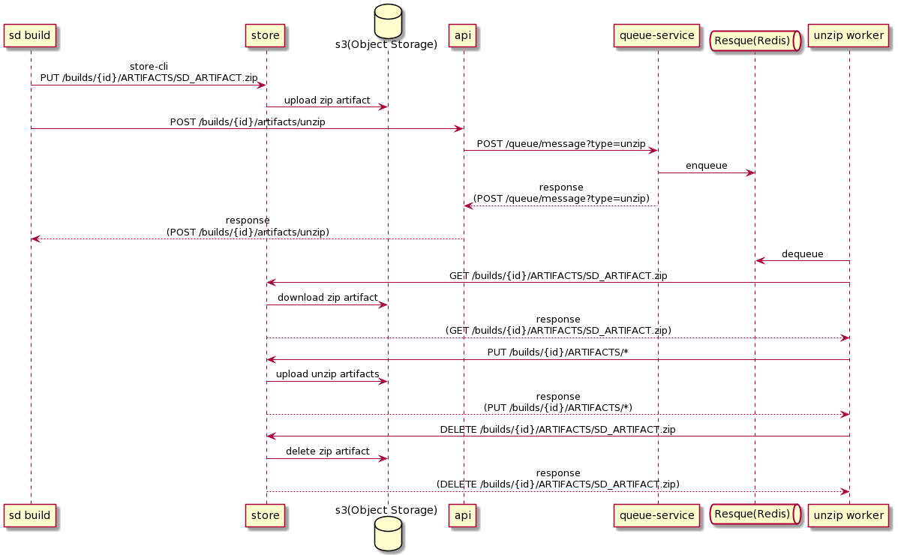

# SD ZIP ARTIFACTS

## Context

Currently SD_ZIP_ARTIFACTS function depends on AWS Lambda which has some resource limitation. To be free from the limitation, Screwdriver will have all role to realize the SD_ZIP_ARTIFACTS function.

## Proposal

After uploading a zip file in `sd-teardown-screwdriver-artifact-bookend` step, send a message to the queue.  
The message will be received by the consumer(unzip worker) that unzips the zip file and re-uploads it.

## Overview

Outline:

1. upload zip file to Object Storage(S3) (sd build -> store -> S3)  
1. notify to queue-service after upload zip file (sd build -> api -> queue-service)  
1. send a message to unzip file (queue-service -> Resque)  
1. a consumer(unzip worker) receives the message, then the consumer downloads the zip file and unzips it, re-uploads unzipped files, deletes the zip file

## Flow(Details)

### sd-teardown-screwdriver-artifact-bookend (sd build)

1. When SD_ZIP_ARTIFACTS=true, zip artifacts to SD_ARTIFACT.zip and upload to S3
1. After uploading SD_ARTIFACT.zip, send request to API(/v4/builds/{id}/artifacts/unzip)

### SD API (api)

1. Send request to queue-service

#### API

|Method|URL|Description|
|:--|:--|:--|
|POST|/builds/{id}/artifacts/unzip|send a request to the queue-worker to add a message to unzip the file|

##### Authentication & Authorization

Use sd-token to allow only requests when the build ID in the token and the id in the path are the same.

##### Parameters

|Name|Type|In|Description|Example|
|:--|:--|:--|:--|:--|
|id|integer|path|build ID|12|

##### Response Data

Status(Success): 202 Accepted (Successfully sent a message to queue-service)

|Name|Type|In|Description|Example|
|:--|:--|:--|:--|:--|

No data to response

Status(Error):  
401 Unauthorized (Token is not valid)  
403 Forbidden    (Build ID has no authority)  
404 Not Found    (The specified build id does not exist)  

|Name|Type|In|Description|Example|
|:--|:--|:--|:--|:--|
|statusCode|integer|body|status code|401|
|error|string|body|outline of error|Unauthorized|
|message|string|body|detail message of error|Missing authentication|

### queue-service (queue-service)

1. Create token that has an unzip worker scope.
1. Enqueue the message to queue(Resque) (Queue Name: unzip)

#### JWT Information

|Name|Value|Description|Example|
|:--|:--|:--|:--|
|username|build ID|add build ID as username|12|
|scope|new component name|scope that shows it's a unzip worker|unzip_worker|
|exp|time until unzip|expiration time for JWT. It needs to be valid from sending queue message to re-uploading. Default time should be current time + 2 hours|1634198203|

#### Enqueue information

|Name|Type|Description|Example|
|:--|:--|:--|:--|
|buildId|integer|build ID|12|
|token|string|unzip worker scope JWT|jwt.unzip.token|

#### API

|Method|URL|Description|
|:--|:--|:--|
|POST|/queue/message|enqueue message to unzip file|

##### Authentication & Authorization

Use sd-token to only allow requests from SD API

##### Parameters

|Name|Type|In|Description|Example|
|:--|:--|:--|:--|:--|
|type|string|query|what kind of operation|unzip|
|buildId|integer|body|build ID|12|

##### Response Data

Status(Success): 200 OK (Successfully sent a message to queue)

|Name|Type|In|Description|Example|
|:--|:--|:--|:--|:--|

No data to response.

Status(Error):  
401 Unauthorized (Token is not valid)  
403 Forbidden    (Build ID has no authority)  

|Name|Type|In|Description|Example|
|:--|:--|:--|:--|:--|
|statusCode|integer|body|status code|401|
|error|string|body|outline of error|Unauthorized|
|message|string|body|detail message of error|Missing authentication|

### Unzip Worker (unzip worker)

This is a new component.

1. Receive message from queue(Resque) the name is unzip.
1. Get SD_ARTIFACT.zip from SD Store by using build ID and Token
1. Unzip the SD_ARTIFACT.zip file and re-upload the unzip files to Store
1. If above process fails, retry.
1. If retry fails
    1. Add a statusMessage to the build to notify the user that the unzip has failed
    1. Log the failure.
1. Delete SD_ARTIFACT.zip

### SD Store (store)
Enable the following operations from unzip worker
1. Download SD_ARTIFACT.zip
1. Upload unzipped artifact files
1. Delete SD_ARTIFACT.zip

#### API

|Method|URL|Description|
|:--|:--|:--|
|DELETE|/builds/{id}/{artifact*}|delete zipped artifact files|

##### Authentication & Authorization

- Able to Upload, Download, and Delete artifact files by unzip worker scope token
- Return an error if the build id of the build artifacts to be operated is different from the build id contained in the token

##### Parameters

|Name|Type|In|Description|Example|
|:--|:--|:--|:--|:--|
|id|integer|path|build ID|12|
|artifact*|string|path|path to artifact|ARTIFACTS/SD_ARTIFACT.zip|
