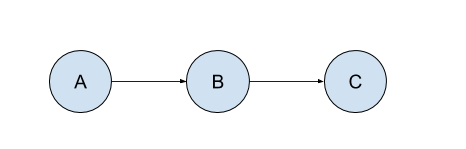
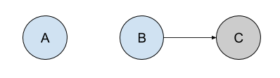

# Workflow

## Context
The current workflow definition has many shortcomings when looking at the future. There are numerous features that can't be addressed by the current design including: branch specific jobs, detached jobs/workflows, rollback, initial job definition, etc.

This documentation covers a design proposal for a revised workflow/screwdriver.yaml configuration.

## Status

- August 30th, 2017: Proposal submitted
- October 25th, 2017: Rebuild_on/triggers sections updated
- April 20th, 2018: Old workflow deprecated

## Syntax

### Determining order

| Job attribute   | Description |
| ---------- | ------------- |
| `requires: ~pr` |  Triggered by a pull request |
| `requires: ~commit` | Triggered by a commit |
| `requires: ~commit:staging` | Triggered by a commit on the `staging` SCM branch only |
| `requires: [A]` __OR__ `requires: A` | Triggered if `A` is successful (_aka. sequential_); should be okay to drop the `[]` if it is a single job in all cases |
| `requires: [A,B,C]` | Triggered after `A`, `B`, and `C` are successful (_aka. join_) |
| `requires: [~sd@123:staging]` |  Triggered after the `staging` job from pipeline `123` is successful |
| `requires: [~pr, ~commit, ~sd@123:staging, A, B]` |  Triggered by a pull request OR commit OR after the `staging` job from pipeline `123` is successful OR after (`A` AND `B`) are successful |

__Rules:__
- If no `requires` is designated, the job is ignored.
- In a requires array, all elements prefixed by a tilde (`~`) are ORs, the rest of the elements are ANDs.

### Special features

| Job annotation   | Description |
| ---------- | ------------- |
| `blocked_by: [A, sd@123:staging]` | Blocked if `A` or `sd@123:staging` job is running |
| `build_periodically: H 4 * * *` | Build periodically ([CRON FORMAT][cron-format]) |
| `freeze_windows: [‘* * ? * MON,FRI’]` | Freeze Windows. Do not run the job during this time. ([CRON FORMAT][cron-format]) |


## Functionality

### Pull request

To specify a multiple jobs to run when a pull request is opened, use the `requires: ~pr` job attribute. In this example, both build A and B will start when a pull request is opened.

```yaml
jobs:
  A:
    requires: ~pr
  B:
    requires: ~pr
```

### SCM Branch-specific jobs

Use a regex filter after `~commit:` to denote a job only run when code changes are made to branches matching that pattern (eg: `/^staging$/`, `/^user-.*$/`).

```yaml
jobs:
  A:
    requires: ~commit:staging
  B:
    requires: ~commit:user-.*
```

### Sequential



When a commit is merged, build A starts. When build A finishes successfully, build B starts. When build B finishes successfully, build C starts.

```yaml
jobs:
  A:
    requires: ~commit
  B:
    requires: A
  C:
    requires: B
```

### Join


When a commit is merged, build A starts. When build A finishes successfully,  build B and build C start. When build B and build C both finish successfully, build D starts.

```yaml
jobs:
  A:
    requires: ~commit
  B:
    requires: A
  C:
    requires: A
  D:
    requires: [B,C]
```


### Remote requires

Specify a job to run when a job from a remote pipeline finishes by using the `~sd@<PIPELINE_ID>:<JOB_NAME>` syntax. To use it, put it under `requires`.


Build C starts when a pull request is opened OR a commit is merged OR after the `staging` job from pipeline `123` finishes successfully OR after `A` AND `B` finish successfully.

```yaml
jobs:
  A
  B
  C:
    requires: [~pr, ~sd@123:staging, A, B]
```


### Blocked_by

If job C or D are running, do not run job A.

```yaml
jobs:
  A:
    requires: ~commit
    annotations:
      blocked_by: [C, D]
```

Similar logic to [jobLock](https://github.com/taskrabbit/node-resque/blob/master/lib/plugins/jobLock.js#L30-L38).

If job A is blocked_by job C and job D:
- In the before_perform hook, keeps polling job C & D every x seconds
- If both are not done, reEnqueue job A
- If both are done, return

_Note: `blocked_by` is an OR; if any of the jobs listed under `blocked_by` is running, then it is blocked._

### Freeze Windows

Jobs will not start except during a user configured time period. Jobs will be queued outside of that time period and run when the window is open.

```yaml
jobs:
  A:
    requires: ~commit
    annotations:
      freeze_windows:
        - "* * ? * MON,FRI"
        - "* 6-17 * * ?"
        - "0-59 1 1 1 ? 2015"
```


### Build Periodically

Jobs will run on a user defined schedule.

```yaml
jobs:
  A:
    requires: ~commit
    annotations:
      build_periodically: H 4 * * *
```


### Collapse


If COMMIT1 is merged, it triggers build A1 to start. If COMMIT2 and COMMIT3 are merged while A1 is still building, their corresponding A builds will be collapsed into one: build A3, which will be put into the queue. Once build A1 has completed, A3 will start. If COMMIT4 is merged while B3 is building, the workflow will be as normal as long as the same jobs don’t run at the same time. If they are, they will be collapsed into the most recent commit event.


When jobs are run in parallel for a join operation, the joined jobs act as one unit, not triggering the next job until both have successfully completed. Jobs that trigger a parallel join, or are triggered by a parallel join could collapse their triggers.


If JobD were a very long running task, it could also collapse multiple sets of join event results, just like JobA can collapse incoming commit triggers.

### Detached Jobs



Detached jobs are standalone jobs, or are not automatically triggered by commits. This gets into a realm of multiple distinct workflows, and is not yet well-defined. See also Build Periodically for an example UML.

In this example, A is triggered by a commit. Job B is a detached job. Job C will run when job B finishes successfully.

```yaml
jobs:
  A:
    requires: ~commit
  B
  C:
    requires: B
```

_Note: Jobs that do not have the `requires` keyword are by default detached jobs._

### Matrix Jobs

Matrix jobs will work very similar to join/parallel builds.


## Contributing

If you make changes to the architecture, please be sure to update this document. To update any architecture diagrams rendered from `.puml` files, just run `npm run diagrams` (you will need to have [graphviz](http://graphviz.org/) installed locally). To update diagrams generated from `.wsd` files use [web sequence diagrams](https://www.websequencediagrams.com/).

## Resources

- [Workflow issue](https://github.com/screwdriver-cd/screwdriver/issues/723)
- [Circleci workflows](http://circleci.com/docs/2.0/workflows)
- [Concourse workflows](http://concourse.ci/pipelines.html)
- [Queue design doc (to keep implementation in mind)](https://github.com/screwdriver-cd/screwdriver/blob/master/design/queue.md)

[cron-format]: http://www.nncron.ru/help/EN/working/cron-format.htm
